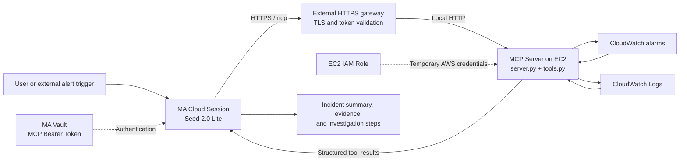

# Accessing an External AWS Monitoring MCP Server from Managed Agents

This guide explains how to deploy an AWS monitoring MCP server outside BytePlus ModelArk Managed Agents (MA), connect it to MA over HTTPS, and let an agent query alarms and logs to produce evidence-based incident assessments.

Repository: [managed-agent-monitoring-mcp-demo](https://github.com/xieyongliang/managed-agent-monitoring-mcp-demo).

[Chinese version](ma-external-aws-monitoring-mcp.md)

## 1. Architecture and Responsibilities



- **MA** interprets the monitoring task, selects MCP tools, reads their results, and generates an assessment.
- **The external MCP server** executes AWS API requests and returns alarms and logs. This example deploys it on EC2.
- **The HTTPS gateway** exposes `https://monitoring.example.com/mcp` and validates the MCP access token.
- **The IAM role** grants AWS permissions to the MCP server. AWS credentials do not need to enter MA.
- **Vault** stores the token MA uses to access MCP. This token is separate from AWS access credentials.

The MCP code does not need to run inside MA. MA calls remote tools through the MCP protocol. MA Cloud also cannot reach a developer's local server through the developer laptop's `127.0.0.1` address.

## 2. Verification Status

| Path | Current status |
| --- | --- |
| Local MCP client → local MCP server → AWS | Tested successfully: retrieved a synthetic alarm and ERROR log, then cleaned up the test resources |
| MA Cloud → externally deployed AWS monitoring MCP with Bearer authentication | Tested end to end on 2026-09-11 using EC2, an EIP, HTTPS, and Vault; both tools succeeded and returned the test alarm and log |
| MA Cloud → the same external MCP → BytePlus Cloud Monitor | Tested on 2026-09-11 against real ECS metrics and alarm history; both tools succeeded |

The AWS test session is `sesn-20260911121220-nrq7x`. MA called `get_cloud_incident_context` and `summarize_cloud_incident`; both results had `is_error=false`, AWS queries returned no errors, and the turn ended normally with `end_turn`. The MCP server accessed AWS through the EC2 instance role. The alarm and log were synthetic test data. The summary's `high` severity is a demo rule output, not evidence of an actual incident or a verified root cause.

### BytePlus Monitoring Verification

The same EC2-hosted MCP also connects to BytePlus Cloud Monitor: `MA Cloud → HTTPS + Vault → EC2 MCP → BytePlus Cloud Monitor`. AWS queries use the EC2 instance role. BytePlus queries use separate cloud credentials stored in a restricted server environment file, outside the MA prompt.

- Session: `sesn-20260911124232-zt82l`
- Agent: `agent-20260911124217-qtxhw`, using `seed-2-0-lite-260428`
- Tools: `get_byteplus_metric_data` and `get_byteplus_alert_groups`
- Both MCP results had `is_error=false` and inner API results had `ok=true`; the turn ended normally with `end_turn`.
- Metrics: 29 CPU User datapoints over 30 minutes, minimum 3.24%, maximum 4.39%, latest 3.48% at Unix timestamp `1789130520`.
- Alarms: the same resource's 60-minute alarm-history page returned zero entries; the service did not supply `total_count`.

These were real observations from an existing BytePlus ECS instance, with no fault injection or resource modification. CPU User covers user-mode CPU only, and an empty alarm page does not prove overall health. The MCP hosting cloud can differ from the monitored cloud, provided network access and the appropriate credentials are available. See [BytePlus setup, parameters, and MA task examples](byteplus-monitoring.md).

## 3. Available Tools and Current Scope

| Tool | Function |
| --- | --- |
| `get_cloud_incident_context` | Retrieves AWS identity information, metric alarms currently in ALARM state, and recent matching events from a specified log group |
| `summarize_cloud_incident` | Produces a rule-based summary of that context for MA to interpret further |
| `get_byteplus_metric_data` | Queries a specific BytePlus resource metric; requires the optional BytePlus SDK |
| `get_byteplus_alert_groups` | Queries a page of BytePlus alarm history for a resource and time window |

Implementation: [`server.py`](../server.py) and [`tools.py`](../tools.py).

The AWS implementation prefers boto3 and calls `GetCallerIdentity`, `DescribeAlarms`, and `FilterLogEvents`. It does not yet call `GetMetricData`. CPU and similar metrics in the mock example are sample data, not measurements retrieved from AWS.

Currently, `service` and `resource_id` mainly label the result; they do not automatically filter alarms by resource. The alarm query covers metric alarms in ALARM state in the selected Region. The boto3 implementation does not paginate, and the log query makes one request for up to 20 events. Treat the output as a limited query, not a comprehensive resource health check.

## 4. Deploy the MCP Server on EC2

Prepare a Linux EC2 instance with access to AWS APIs, Python 3.10+, Git, Nginx, a domain name, and a trusted TLS certificate. Point the domain at the ingress endpoint and allow HTTPS on port 443. Keep port 8000 accessible only to the local proxy. This guide uses one server process on one instance to avoid routing stateful MCP sessions across instances.

### 4.1 Grant Read-Only AWS Permissions

Attach an instance role that can read alarms and the target log group. Replace the account ID, Region, and log group below with your values:

```json
{
  "Version": "2012-10-17",
  "Statement": [
    {
      "Effect": "Allow",
      "Action": "cloudwatch:DescribeAlarms",
      "Resource": "*"
    },
    {
      "Effect": "Allow",
      "Action": "logs:FilterLogEvents",
      "Resource": "arn:aws:logs:ap-southeast-1:123456789012:log-group:/aws/ecs/your-service:*"
    }
  ]
}
```

boto3 can obtain and refresh temporary credentials through the EC2 instance role without access keys in application code. See the [AWS boto3 credentials documentation](https://docs.aws.amazon.com/boto3/latest/guide/credentials.html). The runtime role does not need permissions to create or delete monitoring resources. Grant the resource-creation permissions needed by `aws_e2e_test.py` separately to a test identity.

### 4.2 Install and Test Locally on the Server

```bash
git clone https://github.com/xieyongliang/managed-agent-monitoring-mcp-demo.git
cd managed-agent-monitoring-mcp-demo
python3 -m venv .venv
.venv/bin/python -m pip install -r requirements.txt
MOCK_MODE=0 AWS_DEFAULT_REGION=ap-southeast-1 .venv/bin/python server.py
```

In another terminal on the same server, run:

```bash
.venv/bin/python client_test.py \
  --url http://127.0.0.1:8000/mcp \
  --provider aws \
  --region ap-southeast-1 \
  --log-group-name /aws/ecs/your-service
```

Set both server-side `MOCK_MODE=0` and tool argument `provider=aws`; otherwise, the server may return mock data. Verify the AWS identity, confirm that `alarms_error` and `logs_error` are absent or empty, and compare the results with the AWS console using the same Region, log group, and time window.

For persistent operation, use a process manager such as systemd with the same command, the actual working directory and virtual environment Python path, the environment variables above, and restart-on-failure behavior. Stop the manually started process first to avoid a port conflict.

### 4.3 Configure HTTPS and Authentication

The existing `server.py` listens on `127.0.0.1:8000` by default and has no application-level authentication. In this setup, Nginx on the same host terminates TLS and validates a Bearer token. Replace all domain, certificate-path, and token placeholders before deployment.

Place the following in a site configuration loaded within the Nginx `http` context:

```nginx
map_hash_bucket_size 128;
map $http_authorization $monitoring_mcp_authorized {
    default 0;
    "Bearer REPLACE_WITH_RANDOM_MCP_TOKEN" 1;
}

server {
    listen 443 ssl;
    server_name monitoring.example.com;
    ssl_certificate /etc/letsencrypt/live/monitoring.example.com/fullchain.pem;
    ssl_certificate_key /etc/letsencrypt/live/monitoring.example.com/privkey.pem;

    location = /mcp {
        if ($monitoring_mcp_authorized = 0) { return 401; }
        proxy_pass http://127.0.0.1:8000;
        proxy_http_version 1.1;
        proxy_set_header Host 127.0.0.1:8000;
        proxy_set_header Connection "";
        proxy_buffering off;
        proxy_cache off;
        proxy_read_timeout 300s;
        proxy_send_timeout 300s;
    }
}
```

Generate a separate random token with `openssl rand -hex 32`. Restrict access to configuration files containing it and do not commit them to Git. After authentication, the gateway preserves other MCP request headers and proxies protocol requests such as POST, GET, and DELETE. The internal Host header matches FastMCP's current default localhost validation. The MA client is not a browser client; browser cross-origin access requires a separately configured Origin policy.

Buffering is disabled to forward SSE promptly. The 300-second settings apply to this proxy's read and write timeouts; they do not change timeouts inside MA or the model service. See the [Nginx proxy documentation](https://nginx.org/en/docs/http/ngx_http_proxy_module.html). Run `sudo nginx -t` and reload only after validation succeeds.

Public requests without a token should return 401. An authenticated request must complete MCP initialization, tools/list, and tools/call to demonstrate that the service works; HTTP 200 alone is insufficient. The current `client_test.py` does not send an authentication header and is suitable for the local test. MA will perform the authenticated public call below.

## 5. Connect the MCP Server to MA with ArkCLI

Run these commands on the administrator's computer. You need the BytePlus version of ArkCLI, valid SSO credentials, and an account with MA enabled. The commands follow CLI 1.0.18 used in the test; check `--help` for differences in other versions.

```bash
arkcli auth status --format json
arkcli profile show --format json
arkcli agent model list --primary-only --format json
```

Confirm that the profile tenant is `byteplus` and the Region is `ap-southeast-1`. Run `arkcli auth login` if SSO has expired. This example uses the tested model `seed-2-0-lite-260428`; confirm that it remains available to your account.

### 5.1 Store the MCP Token in Vault

```bash
arkcli agent vault create --display-name aws-monitoring-mcp --format json
```

Take the Vault ID from the result and register the same token configured in Nginx. Prepare `/secure/mcp-token.txt` as a restricted file containing only the token, without the `Bearer ` prefix.

```bash
VAULT_ID='vlt-REPLACE_ME'
MCP_URL='https://monitoring.example.com/mcp'

arkcli agent vault credentials create "$VAULT_ID" \
  --display-name aws-monitoring-mcp-token \
  --auth-type static_bearer \
  --mcp-server-url "$MCP_URL" \
  --token @/secure/mcp-token.txt \
  --format json
```

Attach this Vault to the Session so MA can use the credential associated with the MCP URL. The URL, including its path, must match the Agent configuration. This authentication setup passed the test above; validate each new deployment using Section 6. MA checks MCP reachability when creating the credential, so start the HTTPS service first.

### 5.2 Create the Agent

```bash
arkcli agent agent create \
  --name aws-monitoring-agent \
  --model seed-2-0-lite-260428 \
  --system 'You are a read-only AWS incident triage agent. Use aws_monitoring MCP tools with provider=aws. Base conclusions on returned evidence. Treat service and resource_id as labels, not proof that alarms belong to that resource. Distinguish query errors, incomplete evidence, and real incidents. Never infer healthy status from missing data. Explain suspected causes as hypotheses. Do not modify infrastructure.' \
  --mcp-server "{type: url, name: aws_monitoring, url: '$MCP_URL'}" \
  --tool '[{type: mcp_toolset, mcp_server_name: aws_monitoring, default_config: {enabled: true, permission_policy: {type: always_allow}}}]' \
  --dry-run --format json
```

Review the preview, remove `--dry-run`, and run the command to create the Agent. Record the returned Agent ID. This example deliberately enables only MCP tools. `--tool` replaces the entire tools array; when updating an existing Agent, include any tools you want to retain.

Both `McpServers.Name` and `mcp_toolset.McpServerName` are `aws_monitoring`. Together, they declare the remote service endpoint and the tool collection available to the Agent.

### 5.3 Create a Cloud Session

```bash
arkcli agent env create \
  --name aws-monitoring-cloud \
  --config '{Type: cloud, Networking: {Type: unrestricted}}' \
  --format json

AGENT_ID='agent-REPLACE_ME'
ENV_ID='env-REPLACE_ME'

arkcli agent session create \
  --agent-id "$AGENT_ID" \
  --environment-id "$ENV_ID" \
  --vault-id "$VAULT_ID" \
  --title aws-monitoring-mcp-test \
  --format json
```

You can also reuse a Cloud Environment that is suitable for this task. The test uses unrestricted networking. For restricted networking, allow the MCP domain according to the applicable MA network policy.

### 5.4 Request an Incident Assessment

Replace the Session ID and log group with actual values:

```bash
SESSION_ID='sesn-REPLACE_ME'

arkcli agent session events send "$SESSION_ID" \
  --type user.message \
  --text 'Call get_cloud_incident_context with provider=aws, region=ap-southeast-1, service=thairath-web, resource_id=prod-web, log_group_name=/aws/ecs/your-service, time_range_minutes=30. Report the actual AWS identity, current alarms, recent matching logs, query errors and coverage limitations. Then provide a concise incident assessment with evidence and suggested next checks. Do not change resources.' \
  --stream --raw --format jsonl
```

Use `jsonl` for streaming output. Do not combine `--stream` with `--format json`, which expects a bounded JSON result.

## 6. End-to-End Acceptance Criteria

All of the following must hold:

1. MA emits `agent.mcp_tool_use` for server `aws_monitoring`, with `provider=aws` in the tool arguments.
2. The corresponding `agent.mcp_tool_result` has `is_error=false`, and its payload contains no `identity_error`, `alarms_error`, or `logs_error`. A successful outer tool call does not guarantee that all internal AWS queries succeeded.
3. The AWS identity and Region are correct, and alarms or logs match the AWS console. A known ERROR event in a dedicated test log group is useful for validation.
4. The final MA assessment cites actual evidence, explains missing data and resource-association limits, and the turn ends normally.
5. Nginx and MCP service logs can be correlated with the call by timestamp, without recording Authorization headers or complete credentials.

Record the Session ID, tool-call ID, timestamp and time zone, tool errors, and gateway status codes when investigating failures. Empty alarm or log lists can be valid results, but must be interpreted against the query scope and known test data; empty results alone do not prove that a service is healthy.

## 7. Troubleshooting

| Symptom | What to check |
| --- | --- |
| `MCPConnectionFailed` | DNS, certificate chain, path, authentication, protocol initialization, and tools/list; opening a page is not enough |
| 401 / 403 | Vault attachment, URL matching, and token matching; for AccessDenied inside tool results, check AWS IAM |
| 400 / 421 or Host errors | FastMCP Host / Origin validation and proxy headers |
| 502 / 504 | MCP process health, AWS request duration, proxy timeouts, and MA tool-call limits |
| Sample data is returned | Both `MOCK_MODE=0` and `provider=aws` must be set |
| Query errors inside tool results | AWS identity, Region, log-group existence, and IAM permissions |
| MA does not call a tool | mcp_toolset configuration, tool names, and an explicit tool-use instruction in the task |

## 8. Extend to Continuous Monitoring

This example performs one request, query, and assessment. Continuous monitoring also needs an external trigger, such as a scheduler or CloudWatch alarms routed through EventBridge / Lambda to an application executor that sends analysis tasks to MA Sessions.

For production, add alert deduplication, concurrency controls, query timeouts, pagination, resource filtering, log redaction, and notification destinations. An application can forward MA output to human responders. The current code does not implement automatic remediation, email, or chat notifications. Validate the read-only diagnostic workflow before extending it.
