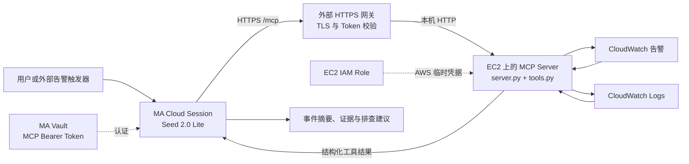

# 在 Managed Agent 中访问外部部署的 AWS 监控 MCP

本文介绍如何将 AWS 监控 MCP 部署在外部服务器上，通过 HTTPS 接入 BytePlus ModelArk Managed Agent（MA），让 Agent 查询告警和日志，并给出有依据的故障分析。

代码仓库：[managed-agent-monitoring-mcp-demo](https://github.com/xieyongliang/managed-agent-monitoring-mcp-demo)。

## 1. 架构与职责



- **MA**：理解监控任务、选择 MCP 工具、读取结果、生成分析。
- **外部 MCP Server**：执行 AWS API 请求，返回告警和日志；本例部署到 EC2。
- **HTTPS 网关**：对外提供 `https://monitoring.example.com/mcp`，验证 MCP 访问令牌。
- **IAM Role**：为 MCP Server 提供 AWS 访问权限，AWS 凭据不需要进入 MA。
- **Vault**：保存 MA 访问 MCP 的令牌。MCP Token 与 AWS AK/SK 是两套不同的凭据。

MCP 代码不需要部署在 MA 内。MA 通过 MCP 协议调用远端工具；MA Cloud 也不能通过开发者电脑的 `127.0.0.1` 访问本地服务。

## 2. 已验证范围

| 路径 | 当前结果 |
| --- | --- |
| 本地 MCP Client → 本地 MCP Server → AWS | 已实测成功，读取到合成告警和 ERROR 日志，随后清理测试资源 |
| MA Cloud → 外部 AWS 监控 MCP + Bearer 认证 | 2026-09-11 已完成 EC2 + EIP + HTTPS + Vault 的端到端实测，两个工具调用成功，读取到测试告警与日志 |

AWS 实测会话为 `sesn-20260911121220-nrq7x`。MA 调用 `get_cloud_incident_context` 和 `summarize_cloud_incident`，两次结果均为 `is_error=false`，AWS 查询无错误，最终以 `end_turn` 正常结束。MCP 使用 EC2 实例角色访问 AWS。告警和日志为合成测试数据；摘要中的 `high` 是示例规则的输出，不代表发生了真实事故或已验证根因。

## 3. 当前代码提供哪些工具

| 工具 | 功能 |
| --- | --- |
| `get_cloud_incident_context` | 获取 AWS 身份信息、当前 ALARM 状态的指标告警、指定日志组近期匹配日志 |
| `summarize_cloud_incident` | 基于上述结果生成规则化摘要，供 MA 进一步解释 |

实现文件：[`server.py`](../server.py)、[`tools.py`](../tools.py)。

AWS 路径优先使用 boto3，调用 `GetCallerIdentity`、`DescribeAlarms`、`FilterLogEvents`。真实 AWS 路径尚未调用 `GetMetricData`；示例中的 CPU 等指标属于 mock 数据，不能当作已获取的 AWS 实测指标。

目前 `service` 和 `resource_id` 主要是结果标签，不会自动按资源筛选告警。告警查询覆盖所选 Region 的 ALARM 状态指标告警；boto3 路径没有翻页，日志也只取一次请求、最多 20 条。因此结果是一次有限范围的查询，不能代表完整资源健康检查。

## 4. 在 EC2 上部署 MCP

准备一台能访问 AWS API 的 Linux EC2，安装 Python 3.10+、Git、Nginx，并准备域名与可信 TLS 证书。将域名解析到入口，开放 HTTPS 443；8000 端口仅供本机代理访问。本文采用单机单进程，避免有状态 MCP 会话被分配到不同实例。

### 4.1 AWS 只读权限

为 EC2 绑定实例角色，允许读取告警及目标日志组。将下面账户、Region 和日志组替换为实际值：

```json
{
  "Version": "2012-10-17",
  "Statement": [
    {
      "Effect": "Allow",
      "Action": "cloudwatch:DescribeAlarms",
      "Resource": "*"
    },
    {
      "Effect": "Allow",
      "Action": "logs:FilterLogEvents",
      "Resource": "arn:aws:logs:ap-southeast-1:123456789012:log-group:/aws/ecs/your-service:*"
    }
  ]
}
```

boto3 可以从 EC2 实例角色获取和刷新临时凭据，无需在代码中配置 AK/SK，见 [AWS boto3 凭据文档](https://docs.aws.amazon.com/boto3/latest/guide/credentials.html)。运行时角色不需要创建或删除监控资源的权限；`aws_e2e_test.py` 创建测试资源所需权限应单独授予测试身份。

### 4.2 安装与本机检查

```bash
git clone https://github.com/xieyongliang/managed-agent-monitoring-mcp-demo.git
cd managed-agent-monitoring-mcp-demo
python3 -m venv .venv
.venv/bin/python -m pip install -r requirements.txt
MOCK_MODE=0 AWS_DEFAULT_REGION=ap-southeast-1 .venv/bin/python server.py
```

在另一终端执行：

```bash
.venv/bin/python client_test.py \
  --url http://127.0.0.1:8000/mcp \
  --provider aws \
  --region ap-southeast-1 \
  --log-group-name /aws/ecs/your-service
```

必须同时设置服务端 `MOCK_MODE=0` 和工具参数 `provider=aws`，否则可能返回 mock 数据。检查 AWS 身份符合预期、`alarms_error` / `logs_error` 为空，并与控制台同一 Region、日志组和时间范围对照。

长期运行时，用 systemd 等进程管理器启动同一命令，指定实际工作目录、虚拟环境 Python 路径，以及上述环境变量，配置失败重启。先停止手工启动的进程，避免端口冲突。

### 4.3 HTTPS 与认证入口

现有 `server.py` 默认监听 `127.0.0.1:8000`，没有应用层认证。下面由同机 Nginx 终止 TLS 并校验 Bearer Token。示例中的域名、证书路径和令牌均为占位符，部署前必须替换。

将以下配置放入 Nginx `http` 上下文加载的站点配置文件：

```nginx
map_hash_bucket_size 128;
map $http_authorization $monitoring_mcp_authorized {
    default 0;
    "Bearer REPLACE_WITH_RANDOM_MCP_TOKEN" 1;
}

server {
    listen 443 ssl;
    server_name monitoring.example.com;
    ssl_certificate /etc/letsencrypt/live/monitoring.example.com/fullchain.pem;
    ssl_certificate_key /etc/letsencrypt/live/monitoring.example.com/privkey.pem;

    location = /mcp {
        if ($monitoring_mcp_authorized = 0) { return 401; }
        proxy_pass http://127.0.0.1:8000;
        proxy_http_version 1.1;
        proxy_set_header Host 127.0.0.1:8000;
        proxy_set_header Connection "";
        proxy_buffering off;
        proxy_cache off;
        proxy_read_timeout 300s;
        proxy_send_timeout 300s;
    }
}
```

以 `openssl rand -hex 32` 生成独立随机令牌，保护包含令牌的配置文件权限，不提交到 Git。网关认证后保留其他 MCP 请求头，并代理 POST、GET、DELETE 等协议请求。内部 Host 设为本机地址，以匹配当前 FastMCP 的默认 Host 校验；MA 客户端没有浏览器 Origin 头，浏览器跨域调用需要另外配置 Origin 策略。

关闭缓冲是为及时转发 SSE；此处的 300 秒是我们配置的代理读写超时，不会修改 MA 或模型服务自身的超时。指令含义见 [Nginx 代理文档](https://nginx.org/en/docs/http/ngx_http_proxy_module.html)。修改后执行 `sudo nginx -t`，通过后再 reload。

公网无 Token 请求应返回 401。真实令牌请求需要完成 MCP initialize、tools/list 和 tools/call 才能证明可用，仅看到 HTTP 200 不足以验收。当前 `client_test.py` 不带认证 Header，可用于本机测试；公网认证调用在下面由 MA 完成。

## 5. 用 ArkCLI 将 MCP 接入 MA

以下命令在管理员电脑执行。需要 BytePlus 版 ArkCLI、有效 SSO，以及已开通的 MA。根据本次实测 CLI 1.0.18 的命令编写；版本差异可用 `--help` 检查。

```bash
arkcli auth status --format json
arkcli profile show --format json
arkcli agent model list --primary-only --format json
```

确认 profile 属于 `byteplus`、Region 为 `ap-southeast-1`。SSO 过期时执行 `arkcli auth login`。下面模型使用已验证的 `seed-2-0-lite-260428`，使用前确认当前账号仍可用。

### 5.1 在 Vault 保存 MCP Token

```bash
arkcli agent vault create --display-name aws-monitoring-mcp --format json
```

从结果取得 Vault ID，然后注册与 Nginx 相同的令牌。`/secure/mcp-token.txt` 是仅包含令牌的受限文件，需提前准备；不要包含 `Bearer ` 前缀。

```bash
VAULT_ID='vlt-REPLACE_ME'
MCP_URL='https://monitoring.example.com/mcp'

arkcli agent vault credentials create "$VAULT_ID" \
  --display-name aws-monitoring-mcp-token \
  --auth-type static_bearer \
  --mcp-server-url "$MCP_URL" \
  --token @/secure/mcp-token.txt \
  --format json
```

后续将 Vault 挂到 Session，让 MA 使用对应 MCP URL 的凭据。URL 要与 Agent 中的配置一致，包括路径。此认证组合已在本次实测通过；新部署仍需按第 6 节验收。创建凭据时 MA 会检查 MCP 可达性，应先确保 HTTPS 服务已启动。

### 5.2 创建 Agent

```bash
arkcli agent agent create \
  --name aws-monitoring-agent \
  --model seed-2-0-lite-260428 \
  --system 'You are a read-only AWS incident triage agent. Use aws_monitoring MCP tools with provider=aws. Base conclusions on returned evidence. Treat service and resource_id as labels, not proof that alarms belong to that resource. Distinguish query errors, incomplete evidence, and real incidents. Never infer healthy status from missing data. Explain suspected causes as hypotheses. Do not modify infrastructure.' \
  --mcp-server "{type: url, name: aws_monitoring, url: '$MCP_URL'}" \
  --tool '[{type: mcp_toolset, mcp_server_name: aws_monitoring, default_config: {enabled: true, permission_policy: {type: always_allow}}}]' \
  --dry-run --format json
```

检查预览后，去掉 `--dry-run` 执行创建，记录返回的 Agent ID。这里刻意只启用 MCP 工具。`--tool` 会替换完整工具数组；若用于更新已有 Agent，需自行保留希望继续使用的工具。

`McpServers.Name` 与 `mcp_toolset.McpServerName` 都为 `aws_monitoring`，分别声明远端服务地址和允许 Agent 使用的工具集合。

### 5.3 创建 Cloud Session

```bash
arkcli agent env create \
  --name aws-monitoring-cloud \
  --config '{Type: cloud, Networking: {Type: unrestricted}}' \
  --format json

AGENT_ID='agent-REPLACE_ME'
ENV_ID='env-REPLACE_ME'

arkcli agent session create \
  --agent-id "$AGENT_ID" \
  --environment-id "$ENV_ID" \
  --vault-id "$VAULT_ID" \
  --title aws-monitoring-mcp-test \
  --format json
```

也可复用已确认适合该任务的 Cloud Environment。测试采用 unrestricted 网络；改成受限网络时，需要按实际 MA 网络策略放行 MCP 域名。

### 5.4 发起监控分析

替换为真实 Session ID 和日志组：

```bash
SESSION_ID='sesn-REPLACE_ME'

arkcli agent session events send "$SESSION_ID" \
  --type user.message \
  --text 'Call get_cloud_incident_context with provider=aws, region=ap-southeast-1, service=thairath-web, resource_id=prod-web, log_group_name=/aws/ecs/your-service, time_range_minutes=30. Report the actual AWS identity, current alarms, recent matching logs, query errors and coverage limitations. Then provide a concise incident assessment with evidence and suggested next checks. Do not change resources.' \
  --stream --raw --format jsonl
```

流式输出使用 `jsonl`，不要将 `--stream` 与要求有限 JSON 结果的 `--format json` 组合使用。

## 6. 端到端验收

完整成功需同时满足以下条件：

1. MA 事件中出现 `agent.mcp_tool_use`，服务名为 `aws_monitoring`，参数中 `provider=aws`。
2. 对应 `agent.mcp_tool_result` 的 `is_error=false`，内容不含 `identity_error`、`alarms_error` 或 `logs_error`。外层工具成功不代表内部 AWS 查询全部成功。
3. 返回的 AWS 身份和 Region 正确，告警或日志内容可与控制台核对。最好在专用测试日志组准备一条已知 ERROR 事件。
4. MA 最终分析引用实际证据，明确数据缺失和资源关联限制，并正常结束会话。
5. Nginx 和 MCP 服务日志中可以按时间对应到该次调用，日志不记录 Authorization Header 或完整凭据。

建议记录 Session ID、工具调用 ID、时间和时区、工具错误及网关状态码。没有告警或日志也可能是正确返回；应结合查询范围及已知测试数据判断，不能单凭空列表宣布健康。

## 7. 常见排查点

| 现象 | 检查方向 |
| --- | --- |
| `MCPConnectionFailed` | DNS、证书链、路径、认证、协议初始化及 tools/list；不只检查网页能否打开 |
| 401 / 403 | Vault 是否挂到 Session、URL 是否一致、令牌是否匹配；如工具内部为 AccessDenied，则检查 AWS IAM |
| 400 / 421 或 Host 错误 | 检查 FastMCP Host / Origin 校验与代理请求头 |
| 502 / 504 | MCP 进程状态、AWS 请求耗时、代理超时及 MA 工具调用限制 |
| 返回示例数据 | 同时检查 `MOCK_MODE=0` 与 `provider=aws` |
| 工具结果包含查询错误 | 按 AWS 身份、Region、日志组存在性和 IAM 权限排查 |
| MA 没有调用工具 | 检查 mcp_toolset 配置和工具名称，并在任务中明确要求调用 |

## 8. 从单次分析扩展为持续监控

本例完成一次“请求 → 查询 → 分析”。持续监控还需要外部触发器，例如定时调度器或 CloudWatch 告警经 EventBridge / Lambda 触发业务执行器，再向 MA Session 发送分析任务。

生产化应增加告警去重、并发控制、查询超时、分页、资源过滤、日志脱敏及通知目的地。MA 输出可交由业务系统通知人工；当前代码不包含自动修复，也未实现邮件或聊天通知。先把只读诊断链路验收，再逐步扩展。
